# ER Diagram — ArchiCredit

```mermaid
erDiagram
    CUSTOMERS {
        uuid Id PK
        varchar FirstName
        varchar LastName
        varchar NationalId UK
        varchar Email
        varchar PhoneNumber
        date DateOfBirth
        datetime CreatedAt
        datetime UpdatedAt
    }

    LOANS {
        uuid Id PK
        uuid CustomerId FK
        int LoanType
        decimal PrincipalAmount
        decimal MonthlyProfitRate
        int TermMonths
        date StartDate
        int Status
        int CreditScore
        decimal MonthlyInstallmentAmount
        decimal TotalRepayment
        datetime ApprovedAt
        datetime RejectedAt
        varchar RejectionReason
        datetime CreatedAt
    }

    INSTALLMENTS {
        uuid Id PK
        uuid LoanId FK
        int InstallmentNumber
        decimal Amount
        decimal PrincipalPortion
        decimal ProfitPortion
        date DueDate
        int Status
        datetime PaidAt
    }

    PAYMENTS {
        uuid Id PK
        uuid InstallmentId FK
        decimal Amount
        datetime PaymentDate
        varchar TransactionId
        int Status
    }

    USERS {
        uuid Id PK
        varchar Username UK
        varchar PasswordHash
        int Role
        uuid CustomerId FK
        datetime CreatedAt
    }

    CUSTOMERS ||--o{ LOANS : "has"
    LOANS ||--o{ INSTALLMENTS : "generates"
    INSTALLMENTS ||--o| PAYMENTS : "has"
    USERS }o--o| CUSTOMERS : "linked to"
```

## Relationships

| Relationship | Cardinality | Description |
|---|---|---|
| Customer → Loan | 1 : N | Bir müşteri birden fazla krediye sahip olabilir |
| Loan → Installment | 1 : N | Kredi onaylandığında otomatik taksit planı üretilir |
| Installment → Payment | 1 : 0..1 | Bir taksit en fazla bir ödeme kaydına sahip olabilir |
| User → Customer | N : 0..1 | Kullanıcı hesabı bir müşteriyle ilişkilendirilebilir (kayıt sırasında oluşur) |

## Schema Notes

- **Loan.Status**: Pending (3), Active (1), Closed (2), Rejected (4)
- **Loan.MonthlyProfitRate**: İslami finansman — aylık kar payı oranı (%)
- **Installment.ProfitPortion**: Kar payı (faiz değil)
- **Installment.Status**: Unpaid (0), Paid (1), Overdue (2)
- **Payment.Status**: Failed (0), Success (1)
