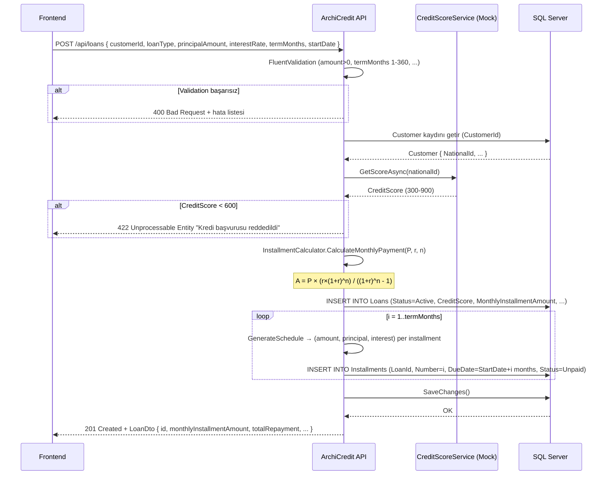
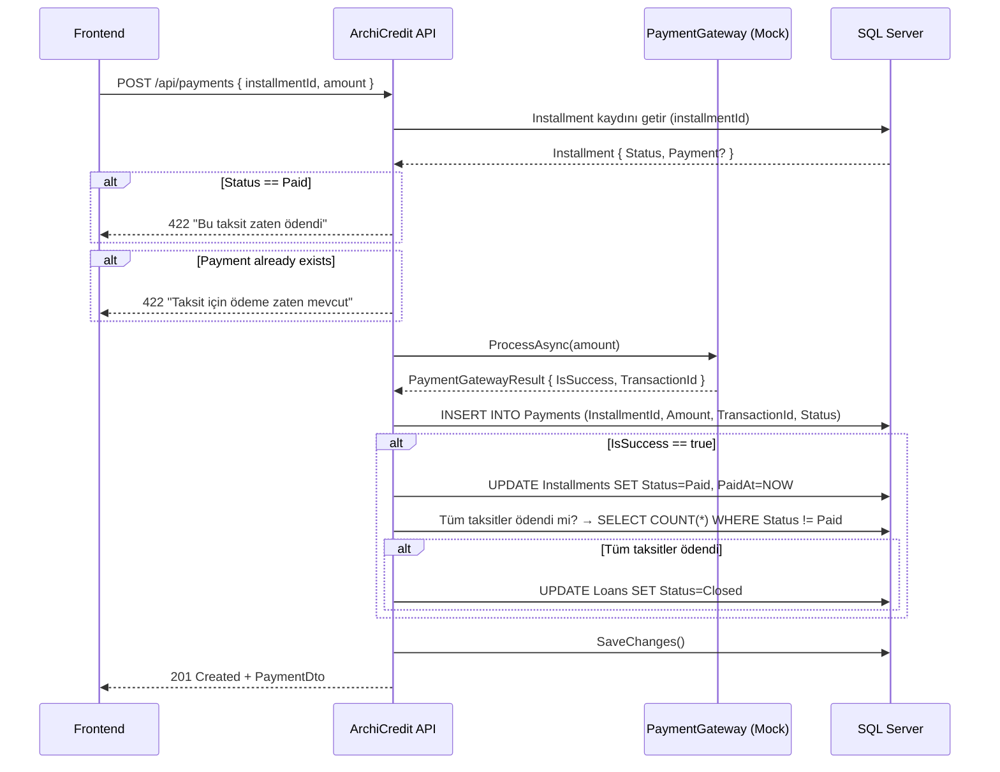

# Kredi Oluşturma → Taksit Üretme Akış Diyagramı

```mermaid
sequenceDiagram
    participant C as Frontend
    participant API as ArchiCredit API
    participant CS as CreditScoreService (Mock)
    participant DB as SQL Server

    C->>API: POST /api/loans { customerId, loanType, principalAmount, interestRate, termMonths, startDate }
    API->>API: FluentValidation (amount>0, termMonths 1-360, ...)

    alt Validation başarısız
        API-->>C: 400 Bad Request + hata listesi
    end

    API->>DB: Customer kaydını getir (CustomerId)
    DB-->>API: Customer { NationalId, ... }

    API->>CS: GetScoreAsync(nationalId)
    CS-->>API: CreditScore (300-900)

    alt CreditScore < 600
        API-->>C: 422 Unprocessable Entity "Kredi başvurusu reddedildi"
    end

    API->>API: InstallmentCalculator.CalculateMonthlyPayment(P, r, n)
    note over API: A = P × (r×(1+r)^n) / ((1+r)^n - 1)

    API->>DB: INSERT INTO Loans (Status=Active, CreditScore, MonthlyInstallmentAmount, ...)

    loop i = 1..termMonths
        API->>API: GenerateSchedule → (amount, principal, interest) per installment
        API->>DB: INSERT INTO Installments (LoanId, Number=i, DueDate=StartDate+i months, Status=Unpaid)
    end

    API->>DB: SaveChanges()
    DB-->>API: OK

    API-->>C: 201 Created + LoanDto { id, monthlyInstallmentAmount, totalRepayment, ... }
```

---

## Ödeme Akışı

```mermaid
sequenceDiagram
    participant C as Frontend
    participant API as ArchiCredit API
    participant PG as PaymentGateway (Mock)
    participant DB as SQL Server

    C->>API: POST /api/payments { installmentId, amount }
    API->>DB: Installment kaydını getir (installmentId)
    DB-->>API: Installment { Status, Payment? }

    alt Status == Paid
        API-->>C: 422 "Bu taksit zaten ödendi"
    end

    alt Payment already exists
        API-->>C: 422 "Taksit için ödeme zaten mevcut"
    end

    API->>PG: ProcessAsync(amount)
    PG-->>API: PaymentGatewayResult { IsSuccess, TransactionId }

    API->>DB: INSERT INTO Payments (InstallmentId, Amount, TransactionId, Status)

    alt IsSuccess == true
        API->>DB: UPDATE Installments SET Status=Paid, PaidAt=NOW
        API->>DB: Tüm taksitler ödendi mi? → SELECT COUNT(*) WHERE Status != Paid
        alt Tüm taksitler ödendi
            API->>DB: UPDATE Loans SET Status=Closed
        end
    end

    API->>DB: SaveChanges()
    API-->>C: 201 Created + PaymentDto
```
